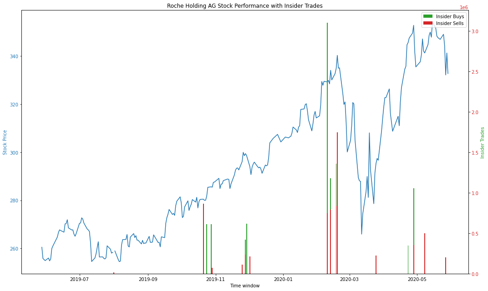
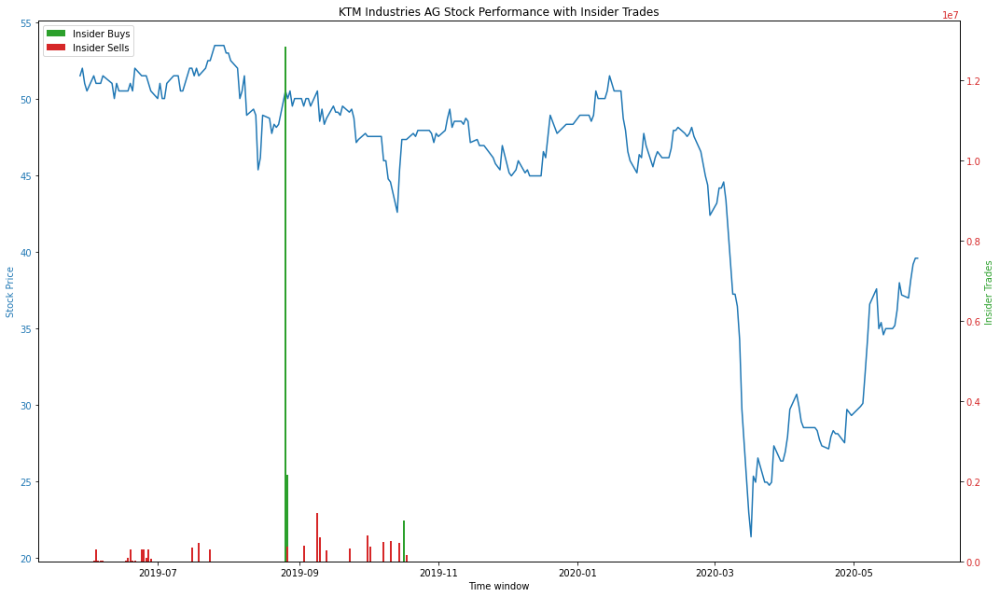
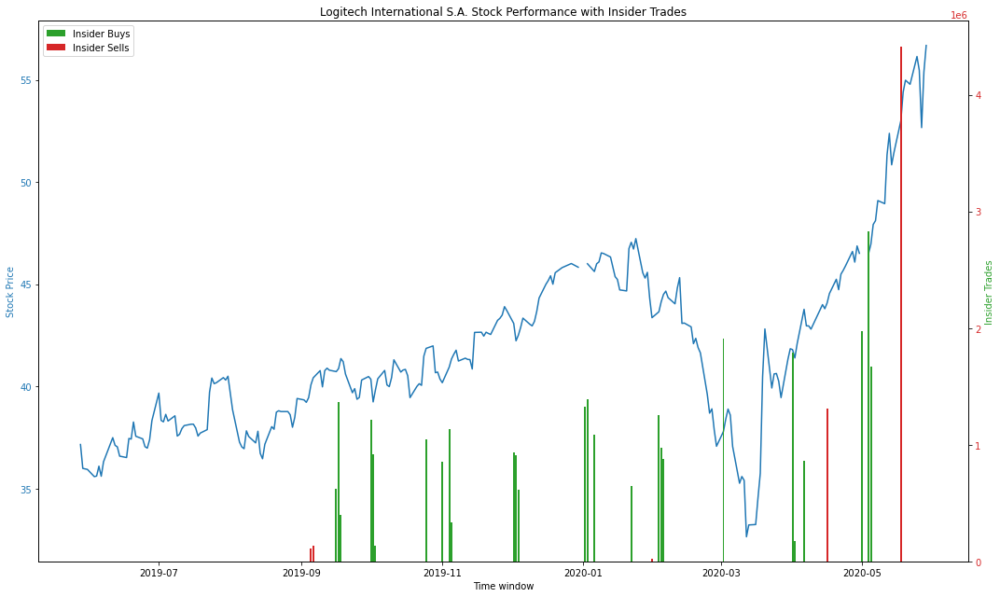
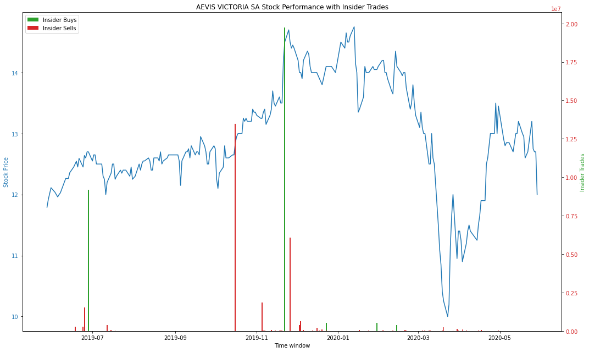

# Insider Trades Webscraper and Plotting
With this script, you can download all insider trade from the SIX Stock exchange. 
In the iPython file, you find how to read in the insider trades for a spefic company and plot its stocks performance against it.
On this page, you can see which companies had the most insider trade and the bottom of this page, you can find the and 4 examples of the plotted outcome.

## This is how the script is set-up:

### Import Libraries
```python
import numpy as np
import pandas as pd
import matplotlib.pyplot as plt
```


### Load Insider Trades
```python
insider = pd.read_csv("InsiderTrades_20200531-183230.csv")
```
I created this file by using selenium webscraper. To see this in action, refer to 
https://github.com/spyglassventures/InsiderTrades/blob/master/Scraper_InsiderTrades.py

### Make date type as date
```python
insider['DATUM'] = pd.to_datetime(insider['DATUM'], format='%d.%m.%Y')
insider = insider.set_index('DATUM')
insider.head()
```

### Show most common companies
```python
insider_most = insider.groupby('EMITTENT').count().reset_index()
insider_most.sort_values('WERT', ascending=False).head(15)
```

|EMITTENT|	WERT|
| ------------- |:-------------:|
|Alpine Select AG	|172|
|nebag ag	|99|
|AEVIS VICTORIA SA	|89|
|Chocoladefabriken Lindt & Sprüngli AG	|61|
|EFG International	|50|
|VZ Holding AG	|44|
|dormakaba Holding AG	|43|
|KTM Industries AG	|42|
|Logitech International S.A.	|42|
|SGS SA	|39|
|Edisun Power Europe AG	|38|
|Roche Holding AG	|37|
|HIAG Immobilien Holding AG	|35|
|Schindler Holding AG	|35|
|Kühne + Nagel International AG	|34|


# Lookup files available for import
```python
import os
os.listdir("./data/") # returns list
```

# This is the only field, where you have to make modifications
You have to specify, which .csv file corresponds with company you choose to display the insider trades with. 
In our case, there is a .csv file available for Roche (ROG.SW_2020-06-01.csv). We later define the stock name as well. It matches the entry from the most common companies with insider trades (see above).

# Load Stock Data
```python
stock = pd.read_csv('./data/ROG.SW_2020-06-01.csv')

# Define name of stock (multiple use)
stock_name = 'Roche Holding AG'

#stock.head()
# Fix Date and index
stock['Date'] = pd.to_datetime(stock['Date'], format='%Y-%m-%d')
stock = stock.set_index('Date')
stock.head()
```
Don't know how to get the stock data? Check out (no pun intended)
https://github.com/spyglassventures/InsiderTrades/blob/master/PlotInsiderWithLoad.ipynb


# Process data and split data in buys and sells
```python
stock1 = stock["Adj Close"]
stock2 = insider[(insider['EMITTENT'] == stock_name) & (insider['TYP']=='Erwerb')]['WERT']
stock3 = insider[(insider['EMITTENT'] == stock_name) & (insider['TYP']=='Veräusserung')]['WERT']
stock3.head()

merged_df = pd.concat(frames, axis=1)
merged_df.head()
```

# Merge the the dataframes again
```python
merged_df['SELLS'] = merged_df['WERT']
merged_df = merged_df.drop(['WERT'], axis=1)

frames2 =  [merged_df, stock3]
merged_df = pd.concat(frames2, axis=1)
merged_df['BUYS'] = merged_df['WERT']
merged_df = merged_df.drop(['WERT'],  axis=1)
merged_df
```

# Plot the result
```python
%matplotlib inline
# Control the default size of figures in this Jupyter notebook
%pylab inline
pylab.rcParams['figure.figsize'] = (15, 9)   # Change the size of plots

fig, ax1 = plt.subplots()

color = 'tab:blue'
ax1.set_xlabel('Time window')
ax1.set_ylabel('Stock Price', color=color)
ax1.plot(merged_df['Adj Close'].index, merged_df['Adj Close'], color=color, 
         label=("Stock Price of "+stock_name))
ax1.tick_params(axis='y', labelcolor=color)

ax2 = ax1.twinx()  # instantiate a second axes that shares the same x-axis

color = 'tab:green'
ax2.set_ylabel('Insider Trades', color=color)  # we already handled the x-label with ax1
ax2.bar(merged_df['Adj Close'].index, merged_df['BUYS'], color=color, label="Insider Buys")
ax2.tick_params(axis='y', labelcolor=color)

color = 'tab:red'
#ax2.set_ylabel('sin2', color=color)  # we already handled the x-label with ax1
ax2.bar(merged_df['Adj Close'].index, merged_df['SELLS'], color=color, label="Insider Sells")
ax2.tick_params(axis='y', labelcolor=color)
plt.legend()
plt.title(stock_name+" Stock Performance with Insider Trades")
fig.tight_layout()  # otherwise the right y-label is slightly clipped
plt.show()
```
___

Fig. 1: Stock performance of Roche Holdings vs. Insider Trades
<p align="center">
  
</p>

Fig. 2: Stock performance of KTM Industries vs. Insider Trades
<p align="center">
  
</p>

<p>
Fig. 4: Stock performance of Logitech vs. Insider Trades
<p align="center">
  
</p>

<p>
Fig. 4: Stock performance of Aevis Victoria vs. Insider Trades
<p align="center">
  
</p>

