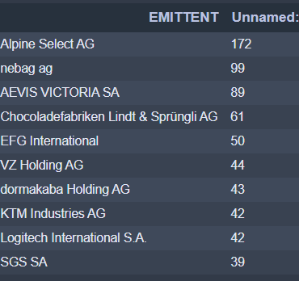
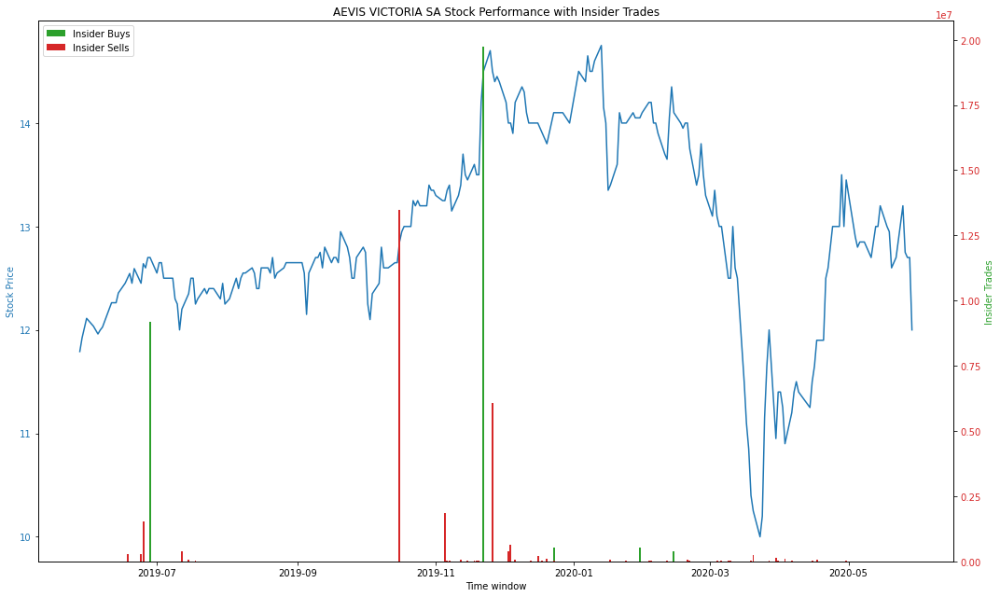

# InsiderTrades Webscraper and Plotting

With this script, you can download all insider trade from the SIX Stock exchange. 
In the iPython file, you find how to read in the insider trades for a spefic company and plot its stocks performance against it.
Find below the companies with most insider trades within the last year and 3 examples of the outcome.

  

Fig. 1: Stocks with most frequent Insider Trades

Example 1:

  

Fig. 1:Stock performance of KTM vs. Insider Trades

Example 2:

  

Fig. 1:Stock performance of KTM vs. Insider Trades

Example 3:

  

Fig. 1:Stock performance of KTM vs. Insider Trades
